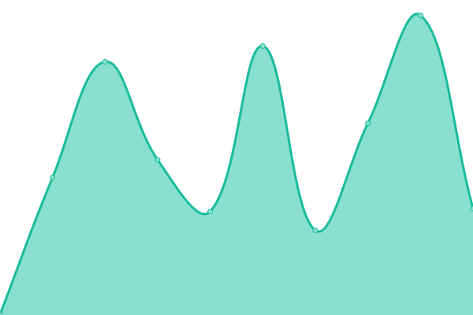
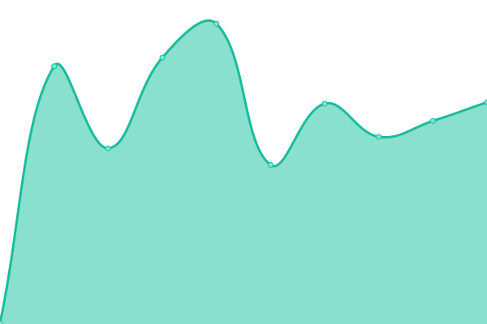
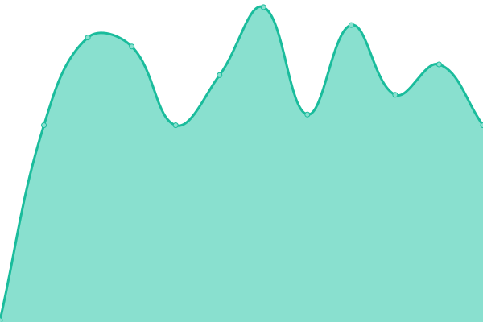

# [📈 Live Status](https://eighty.io): <!--live status--> **🟧 Partial outage**

This repository contains the open-source uptime monitor and status page for [Dave](https://davelevine.io), powered by [Upptime](https://github.com/upptime/upptime).

With [Upptime](https://upptime.js.org), you can get your own unlimited and free uptime monitor and status page, powered entirely by a GitHub repository. We use [Issues](https://github.com/davelevine/upptime/issues) as incident reports, [Actions](https://github.com/davelevine/upptime/actions) as uptime monitors, and [Pages](https://eighty.io) for the status page.

<!--start: status pages-->
<!-- This summary is generated by Upptime (https://github.com/upptime/upptime) -->
<!-- Do not edit this manually, your changes will be overwritten -->
<!-- prettier-ignore -->
| URL | Status | History | Response Time | Uptime |
| --- | ------ | ------- | ------------- | ------ |
|  [Bookstack](https://www.levine.xyz) | 🟩 Up | [bookstack.yml](https://github.com/davelevine/upptime/commits/HEAD/history/bookstack.yml) | 

 461ms
     
 | 

<a href="https://eighty.io/history/bookstack">100.00%</a>
    

|  [Code-Server](https://wired.io) | 🟩 Up | [code-server.yml](https://github.com/davelevine/upptime/commits/HEAD/history/code-server.yml) | 

 301ms
     
 | 

<a href="https://eighty.io/history/code-server">100.00%</a>
    

|  [Knowledge](https://www.levine.org) | 🟩 Up | [knowledge.yml](https://github.com/davelevine/upptime/commits/HEAD/history/knowledge.yml) | 

 313ms
     
 | 

<a href="https://eighty.io/history/knowledge">100.00%</a>
    

|  [Resume](https://www.davidlevine.com) | 🟩 Up | [resume.yml](https://github.com/davelevine/upptime/commits/HEAD/history/resume.yml) | 

 132ms
     
 | 

<a href="https://eighty.io/history/resume">100.00%</a>
    

|  [Search](https://search.cc) | 🟩 Up | [search.yml](https://github.com/davelevine/upptime/commits/HEAD/history/search.yml) | 

 154ms
     
 | 

<a href="https://eighty.io/history/search">96.54%</a>
    

|  [Status](https://www.status.cc) | 🟥 Down | [status.yml](https://github.com/davelevine/upptime/commits/HEAD/history/status.yml) | 

 583ms
     
 | 

<a href="https://eighty.io/history/status">96.23%</a>
    

|  [Technicality](https://www.technicality.com) | 🟩 Up | [technicality.yml](https://github.com/davelevine/upptime/commits/HEAD/history/technicality.yml) | 

 100ms
     
 | 

<a href="https://eighty.io/history/technicality">99.69%</a>
    

<!--end: status pages-->

[**Visit our status website →**](https://eighty.io)

## 📄 License

- Powered by: [Upptime](https://github.com/upptime/upptime)
- Code: [MIT](./LICENSE) © [Dave](https://davelevine.io)
- Data in the `./history` directory: [Open Database License](https://opendatacommons.org/licenses/odbl/1-0/)
